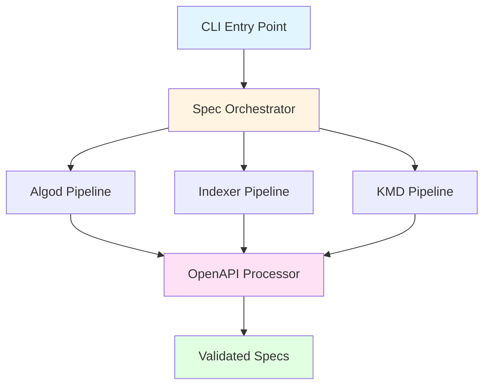
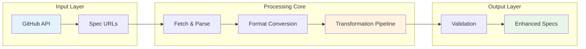
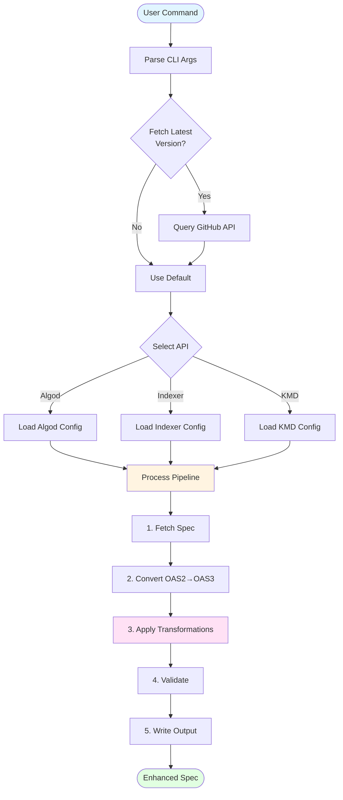
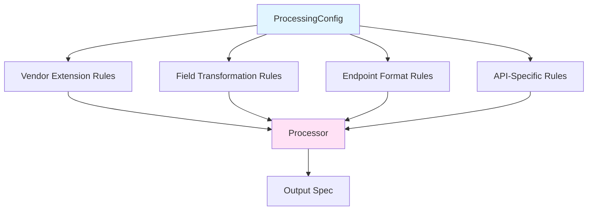
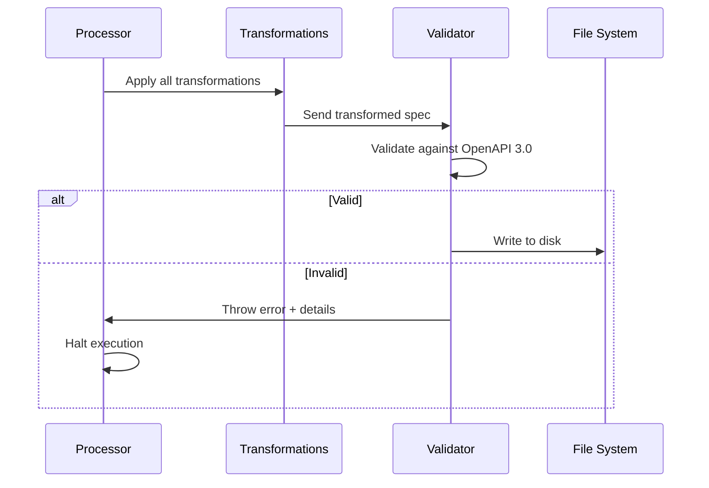
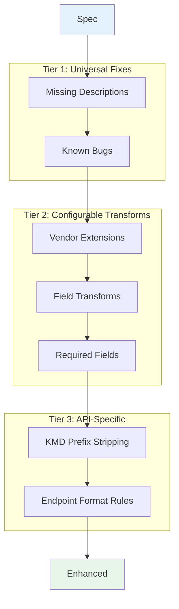
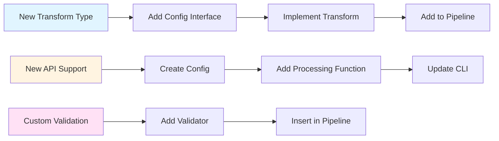

# Architecture

This document describes the logical architecture and design of the Algorand OpenAPI Converter, highlighting system structure, data flow and patterns.

## Overview

The converter is a data transformation pipeline that enriches Algorand API specifications with metadata for multi-language code generation. It operates in five stages: **Fetch** → **Convert** → **Transform** → **Validate** → **Output**.

## System Architecture

The converter employs a layered architecture where each layer has distinct responsibilities and clear boundaries. The system is organized into four distinct layers that work together to transform raw API specifications into enhanced, validated outputs.

The CLI Layer handles argument parsing and determines which pipeline to execute. The Orchestration Layer coordinates version fetching from GitHub and routes work to the appropriate API pipeline. The Processing Layer contains the core transformation engine that applies all modifications to the specifications. Finally, the Output Layer validates the transformed specs and writes them to disk.

The Input Layer retrieves specifications from GitHub repositories and resolves them to concrete URLs. The Processing Core handles the heavy lifting of fetching, parsing, format conversion, and transformation. The Output Layer ensures quality through validation before persisting the enhanced specifications to disk.

## Data Flow

Data flows through the system in a series of stages, from user input to final output. The processing pipeline is designed to be linear and deterministic, ensuring that each API specification passes through the same sequence of transformations.

### Processing Pipeline

The following diagram illustrates the complete flow from user command to enhanced specification output, including decision points for version fetching and API selection.

### Transformation Pipeline Architecture

Once a specification reaches the transformation stage, it passes through a series of sequential modifications. Each transformation builds upon the previous ones, progressively enriching the specification with metadata and corrections.

Transformations fall into five categories. Compliance fixes address missing descriptions and schema errors required by OpenAPI 3.0. Type enrichment adds metadata like BigInt markers and binary data annotations. Field corrections adjust required/optional declarations and add validation constraints. Endpoint configuration enforces format requirements, specifying whether endpoints use JSON or msgpack. API-specific transformations handle unique requirements of individual APIs.

## Design Principles

### 1. Pipeline-Based Architecture

Each transformation operates as an independent stage that receives the full specification, applies specific modifications, reports the number of changes made, and passes the result to the next stage. This approach makes it easy to add or remove transformations, provides clear execution order, enables observation at each stage, and allows testing transformations in isolation.

### 2. Configuration-Driven Behavior

Each API (Algod, Indexer, KMD) has unique characteristics that require different transformations. Rather than embedding conditional logic throughout the codebase to handle these differences, the architecture uses declarative configuration objects. Each API defines its requirements through a configuration structure that specifies which transformations to apply, what vendor extensions to add, and which fields need adjustment. This separates the "what" (transformation rules) from the "how" (transformation implementation), making the system more maintainable and allowing new APIs to be added without modifying core transformation logic.

### 3. Recursive Tree Traversal

Transformations use depth-first traversal to find and modify target nodes regardless of their location in the spec tree. The pattern checks each node for match conditions, applies the transformation if matched, recursively processes all child nodes, and returns an aggregate count of modifications. This works with any spec structure without requiring upfront knowledge of the schema.

### 4. Fail-Fast Validation

Ensures no invalid specs are ever written to disk.

## Transformation Strategy

### Three-Tier Transformation Model

The three tiers represent different levels of specificity. Tier 1 transformations apply universally to all specs without configuration. Tier 2 transformations are driven by per-API configuration, allowing customization for different needs. Tier 3 transformations are conditional, executing only for specific APIs when required.

## Extension Points

The architecture supports extension at multiple levels:

Extensions can be added horizontally by introducing new transformation types, vertically by supporting additional API specifications, or through cross-cutting concerns like custom validation rules. Each extension point integrates into the existing pipeline structure.

## Quality Attributes

### Maintainability

The system maintains clarity through single-purpose transformations, declarative configuration, clear naming conventions, and comprehensive logging. Each component has a well-defined responsibility that's easy to understand and modify.

### Observability

The pipeline provides visibility through transformation counts, version information logging, contextual error messages, and console output showing progress. Users can see exactly what the tool is doing at each stage.

### Reliability

The architecture ensures correctness through fail-fast validation, GitHub API fallbacks, error handling at boundaries, and type safety via TypeScript. Invalid specs never reach the output stage.

### Extensibility

The design supports growth through a plugin-like transformation system, configuration-driven behavior, well-defined extension points, and minimal coupling between stages. New functionality can be added without modifying existing code.
